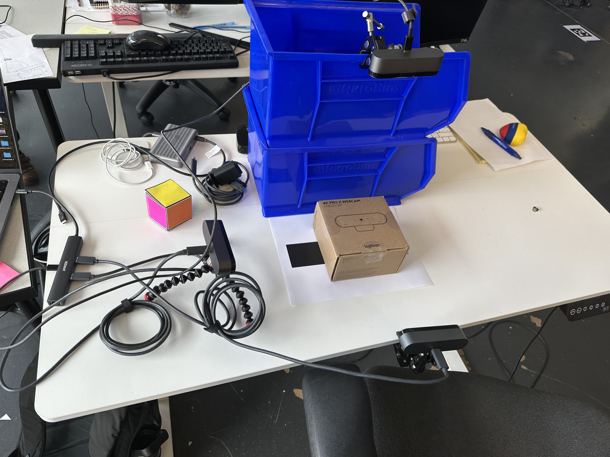
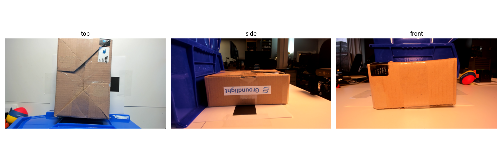

# Box Orientation Demo
Multi-camera application for determining the orientation of boxes

## Physical setup
We have 3 usb webcams (logitech brios) plugged into a USB hub, which is then connected to a MacBook Pro 14. The cameras are placed such that they provide a view of the box from the top, the front, and the side.

## Set up
1. Clone the repository
2. Install the uv package manager. Link to instructions [here](https://docs.astral.sh/uv/getting-started/installation/).
3. Install the dependencies with `uv`: `uv sync`
4. Put your Groundlight API token in the `.env` file. You can get a key by signing up at [Groundlight](https://dashboard.groundlight.ai), and then creating an API [token](https://dashboard.groundlight.ai/reef/my-account/api-tokens).

## Run the demo

1. Verify that the cameras are working: `uv run src/box_orientation/cameras.py`. This will open a window with the three camera views. If the views are not properly labeled, you might need to adjust the order of the camera views in the `src/box_orientation/cameras.py` file on the line `cameras = Cameras(view_names=["top", "side", "front"])`. Once you determine the correct order, update the order on the line `self.view_names = ["top", "front", "side"]` in the `src/box_orientation/orientation.py` file to match. 

2. Run the demo: `uv run src/box_orientation/orientation.py`. It will first ask you to onboard your box. This will involve taking an image of each side of the box using the camera positioned to capture the box from the top. Then it will start a while loop, predicting the orientation of the box every few seconds. Groundlight's cloud labelers will automatically start labeling images as they are captured, and Groundlight will build and continuously update the models necessary for the demo. You can review the performance of the models or add your own labels on the Groundlight [dashboard](https://dashboard.groundlight.ai/). 

